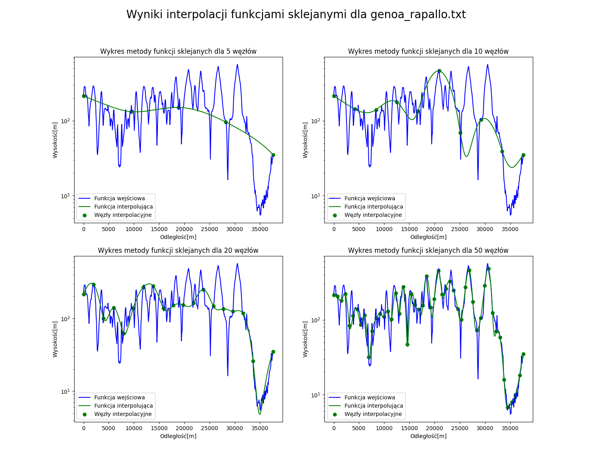

# Elevation Profile Approximation

A comparative study of interpolation methods for approximating topographical elevation profiles.

## Project Overview

This project analyzes and compares different interpolation techniques for approximating elevation profiles from discrete measurement points. Elevation profiles are crucial for cyclists, runners, tourists, and engineers working on transportation infrastructure, as they provide intuitive visualization of terrain characteristics along a route.

## Methods Implemented

### 1. Lagrange Polynomial Interpolation
- **Approach**: Constructs a single polynomial of degree N based on N+1 interpolation nodes
- **Implementation**: Uses equally spaced interpolation nodes
- **Advantages**: Simple implementation, no need for derivatives or solving equation systems
- **Disadvantages**: Global approximation character, susceptible to Runge's phenomenon

### 2. Lagrange Interpolation with Chebyshev Nodes
- **Approach**: Same polynomial method but with strategically placed Chebyshev nodes
- **Node Distribution**: Higher density at interval endpoints, defined by cosine function
- **Advantages**: Significantly reduces Runge's phenomenon, better accuracy scaling
- **Disadvantages**: Fewer nodes in the middle of intervals, may miss critical points

### 3. Cubic Spline Interpolation
- **Approach**: Local interpolation using low-degree polynomials between nodes
- **Implementation**: Third-degree polynomials with continuity conditions for derivatives
- **Advantages**: Local character, excellent accuracy that improves with more nodes
- **Disadvantages**: Requires derivative calculations and solving large equation systems

## Test Datasets

The analysis was conducted on four different topographical profiles:

- **Mount Everest Fragment**: Single prominent elevation with ~2000m height difference
- **Chelm Profile**: Relatively flat terrain with minimal height variations (~3m)
- **Genoa-Rapallo Route**: Multiple steep elevations with strong oscillations (~500m difference)
- **Grand Canyon**: Single steep descent profile (~1750m height difference)

## Technical Implementation

- **Grid Resolution**: 512 points for all tests
- **Node Counts Tested**: 5, 10, 20, and 50 interpolation nodes
- **Numerical Stability**: Data normalized to [-1, 1] interval for polynomial methods
- **Visualization**: Logarithmic scaling used for better analysis of interpolation properties

## Key Findings

### Runge's Phenomenon
A critical issue observed in polynomial interpolation where increasing the number of nodes paradoxically worsens approximation quality, especially at interval boundaries. This phenomenon can produce errors several orders of magnitude larger than expected values.

### Method Performance Summary

**Simple Lagrange Interpolation:**
- Works reasonably well for simple profiles with few nodes
- Severely affected by Runge's phenomenon with more nodes
- Unacceptable errors for oscillating profiles

**Chebyshev Node Lagrange:**
- Successfully mitigates Runge's phenomenon
- Provides excellent results for smooth profiles
- Still struggles with highly oscillating terrain
- May miss critical features due to reduced node density in interval centers

**Cubic Splines:**
- Consistently best performance across all profile types
- Accuracy improves reliably with increasing node count
- Successfully handles complex oscillating profiles
- Only method capable of accurately capturing fine terrain details

## Conclusions

The study demonstrates that **cubic spline interpolation** is the most robust and accurate method for elevation profile approximation, despite its computational complexity. While Lagrange interpolation methods are simpler to implement, they are limited by fundamental mathematical constraints that make them unsuitable for complex terrain profiles. For practical applications requiring high accuracy in terrain modeling, the additional computational cost of cubic splines method is justified by it's performance and reliability across diverse topographical conditions.

## Docs
This proejct includes report written in Polish, placed in report directory.
